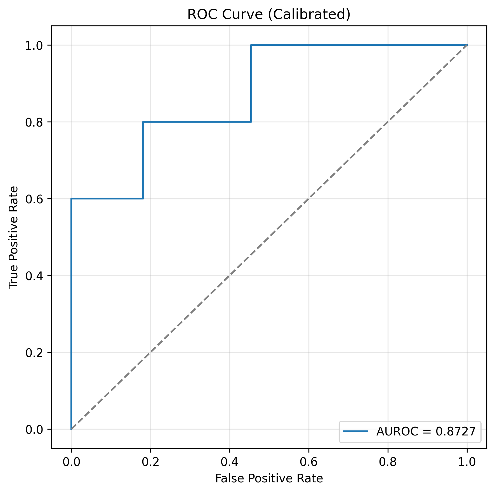
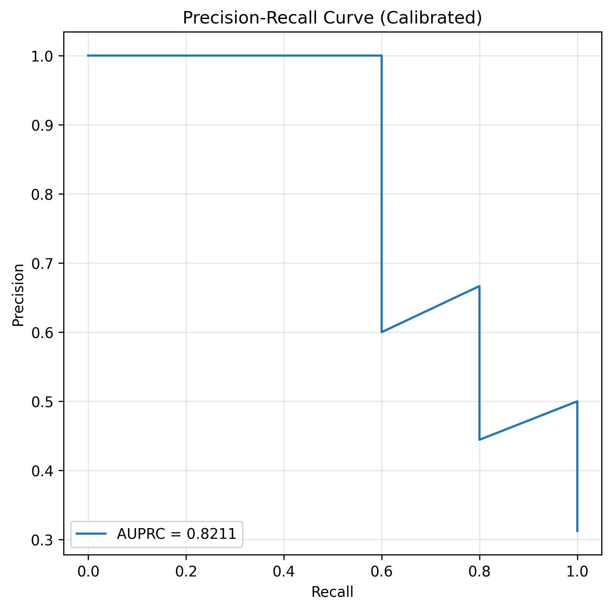
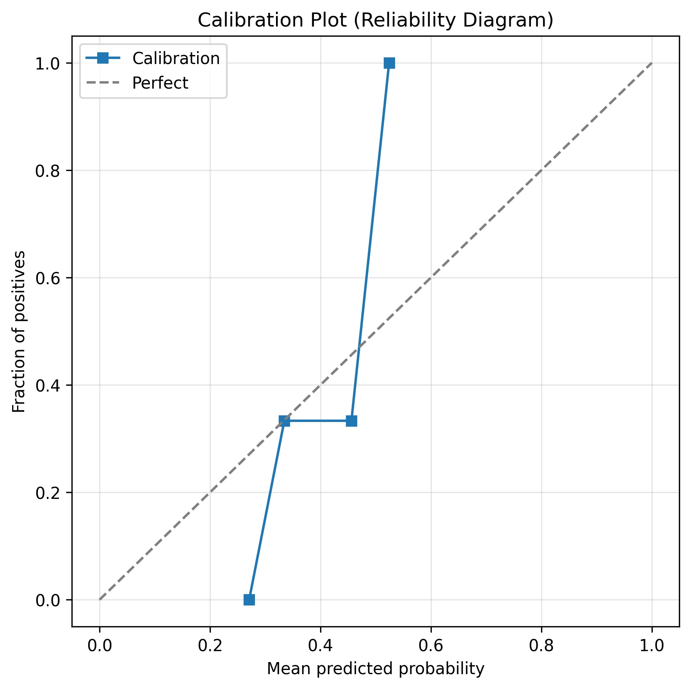

# LatentODE — ICU Patient Monitoring (Neural ODE)

Professional implementation of a continuous-time patient monitoring pipeline using a Latent Neural ODE with a Transformer encoder and an evidential classifier.

This repository contains preprocessing, model training, calibration and evaluation code, and a set of visualizations and results produced during development.

---

## Highlights

- Handles irregularly sampled multivariate vital-sign time series.
- Continuous-time latent modeling via an Augmented Neural ODE.
- Transformer-based encoder for set/sequence encoding.
- Evidential classifier for uncertainty-aware risk scoring.
- Calibration (Platt + temperature) and validation-based threshold selection.
- Training improvements: class-balanced sampling, dropout regularization, early stopping and best-checkpoint restore.

---

## Quick links

- Code: `src/`
- Preprocessing: `src/preprocessing.py`
- Model: `src/model.py` (Transformer + Augmented Neural ODE + Evidential classifier)
- Training: `src/train.py` (ImprovedTrainer with sampler, early stopping)
- Evaluation & calibration: `src/evaluate.py`
- Results and plots: `results/`

---

## Installation

Create and activate a Python virtual environment, then install requirements:

```bash
# from project root
python -m venv venvs/common-ml-env
source venvs/common-ml-env/Scripts/activate   # on Windows/Git Bash
pip install -r requirements.txt
```

Note: this project depends on scientific packages (PyTorch, sklearn) and `torchdiffeq` for ODE integration.

---

## Reproduce the pipeline

1. Preprocess (creates `data/processed/*`):

```bash
python src/preprocessing.py
```

2. Train (example, adjust hyperparameters inside `src/train.py`):

```bash
python src/train.py
```

3. Evaluate (calibrates on validation and evaluates test set; saves plots and metrics to `results/`):

```bash
python src/evaluate.py
```

After evaluation, the following key outputs will be in `results/`:

- `test_evaluation.txt` — raw metrics
- `test_evaluation_calibrated.txt` — calibrated + thresholded metrics
- `platt_params.txt` / `temperature.txt` — calibration parameters
- `threshold.txt` — chosen decision threshold on validation
- `roc_curve_calibrated.png`, `pr_curve_calibrated.png`, `calibration_plot.png` — visual diagnostics
- Other visualizations: `attention_weights.png`, `patient_trajectory.png`, `latent_space_tsne.png`, `ode_dynamics.png`, `feature_importance.png`

---

## Results snapshot (example)

The latest evaluation (calibrated) produced the following summary (see `results/test_evaluation_calibrated.txt` for full details):

- AUROC: 0.8727
- AUPRC: 0.8333
- Accuracy: 0.6875
- Precision: 0.50
- Recall: 1.00
- F1: 0.6667
- Decision threshold (selected on validation): 0.32

Calibration and diagnostic plots (examples from `results/`):







Other visualizations saved in `results/`:

- Attention heatmap: `results/attention_weights.png`
- Predicted patient trajectory: `results/patient_trajectory.png`
- Latent space (t-SNE): `results/latent_space_tsne.png`
- ODE latent dynamics: `results/ode_dynamics.png`
- Feature importance: `results/feature_importance.png`

---

## Design notes & rationale

- Preprocessing: the pipeline now fits normalization (StandardScaler) on the training split only to prevent leakage. Temporal features (time deltas, periodic encodings) are added per-sequence.
- Model: Transformer encoder pools variable-length sequences to produce a latent distribution (mu, logvar). The latent initial state is evolved with an Augmented Neural ODE and decoded for reconstruction; an evidential classifier outputs Beta-evidence parameters for uncertainty-aware probabilities.
- Calibration: Platt scaling (logistic regression on logits) is used by default for stability on small validation sets; temperature-scaling is available as a fallback. A validation-based threshold (F1-maximizing) is selected and applied to test data.
- Training: class imbalance is mitigated via a WeightedRandomSampler; early stopping and best-checkpoint restore avoid returning an overfit final epoch.

---

## File structure

```
LatentODE-PatientMonitoring/
├─ data/
│  ├─ raw/                # raw synthetic/demo ICU CSV
│  └─ processed/          # pickled sequences + scaler + metadata
├─ models/                 # saved checkpoints
├─ results/                # evaluation outputs, plots
├─ src/
│  ├─ preprocessing.py
│  ├─ model.py
│  ├─ train.py
│  └─ evaluate.py
├─ notebooks/              # exploratory analyses
├─ tools/                  # helpers (quick smoke test)
├─ requirements.txt
├─ setup.py
└─ README.md
```

---

## Next steps (recommended)

1. Stabilize calibration/threshold selection with k-fold calibration or larger validation sets.
2. Add minimal unit tests and CI (GitHub Actions) to ensure reproducibility.
3. Experiment with focal loss, dropout/grid-search, and data augmentation if sensitivity/precision need to improve.
4. Prepare a model card and documentation describing intended clinical use, limitations, and evaluation protocol.

---

## Contribution & License

Contributions welcome — please open issues and PRs. See `LICENSE` for license details.

If you want this README adapted into a project website (GitHub Pages) or a short paper-style summary, I can prepare that next.

